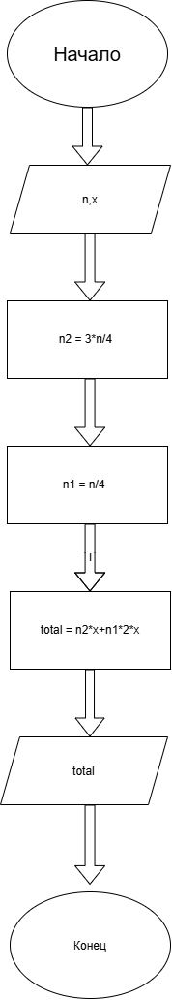

Домашнее задание к работе 2

Условие задачи


Реактивный аэробус летит с пассажирами на борту из Лондона в Нью-Йорк. Три четверти пассажиров имеют билеты второго класса стоимостью `x` фунтов каждый. Остальные пассажиры имеют билеты первого класса, которые стоят вдвое дороже билетов второго класса.
Напишите программу, которая выведет сумму денег, получаемую авиакомпанией от продажи билетов на этот рейс.
---
1. Алгоритм и блок-схема
Алгоритм
Начало.
Задать исходные данные:
`n = 100` — количество пассажиров;
`x = 100` — стоимость билета второго класса.
Вычислить общую сумму денег от продажи билетов:
`total = 5 * n * x / 4`
Вывести значение `total`.
Конец.
Математическое решение
Три четверти пассажиров имеют билеты второго класса:
`3n / 4`
Остальные пассажиры:
`n / 4`
Билет второго класса стоит `x` фунтов, а билет первого класса — `2x` фунтов.
Поэтому общая сумма:
`(3n / 4) * x + (n / 4) * 2x`
Упростим:
`3nx / 4 + 2nx / 4 = 5nx / 4`
Итоговая формула:
`total = 5 * n * x / 4`
Блок-схема

---
2. Реализация программы
```c
#include <stdio.h>

int main()
{
    int n = 100;
    int x = 100;

    printf("Сумма = %d фунтов\n", 5 * n * x / 4);

    return 0;
}
```
Объяснение программы
`n` — количество пассажиров.
`x` — стоимость билета второго класса в фунтах.
В программе используется формула:
```text
5 * n * x / 4
```
Она получается из условия задачи:
```text
(3n/4) * x + (n/4) * 2x
```
При заданных значениях:
```text
n = 100
x = 100
```
получаем:
```text
5 * 100 * 100 / 4 = 12500
```
---
3. Результаты работы программы
Сумма = 12500 фунтов
4. Информация о разработчике
Баранов Игорь бОТИ-262


3. Результаты работы программы
Сумма = 12500 фунтов
4. Информация о разработчике
Баранов Игорь бОТИ-262
